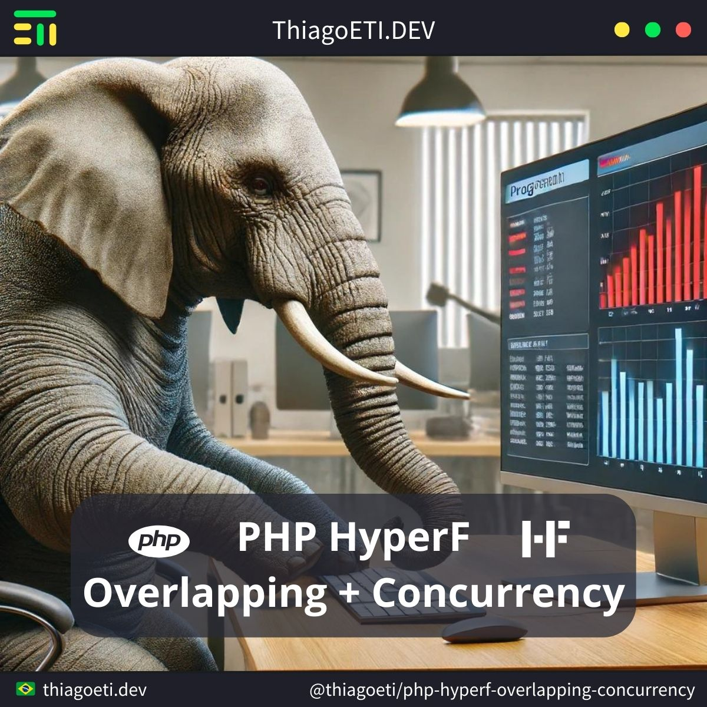

# PHP HyperF -> Overlapping and Concurrency

- PHP: 8.3.7
- PHP HyperF: 3.1.23



## HyperF - Project

It is extremely important that HyperF processes do not overwrite shared variable data. This can occur with overload.

#### Create - Project

```console
composer create-project hyperf/hyperf-skeleton "project"
```

#### Install - Watcher

```console
composer require hyperf/watcher --dev
```

#### Install - UUID

```console
composer require ramsey/uuid
```

#### Server - Start

```console
cd project ;
php bin/hyperf.php server:watch ;
```

## HyperF - APP

#### APP - Router

```php
Router::addRoute(['GET', 'POST'], '/overlapping/data', 'App\Controller\ControllerOverlapping@data');
Router::addRoute(['GET', 'POST'], '/overlapping/value-a', 'App\Controller\ControllerOverlapping@value_a');
Router::addRoute(['GET', 'POST'], '/overlapping/value-b', 'App\Controller\ControllerOverlapping@value_b');
Router::addRoute(['GET', 'POST'], '/overlapping/value-c', 'App\Controller\ControllerOverlapping@value_c');

Router::addRoute(['GET', 'POST'], '/concurrency/data', 'App\Controller\ControllerConcurrency@data');
Router::addRoute(['GET', 'POST'], '/concurrency/value-a', 'App\Controller\ControllerConcurrency@value_a');
Router::addRoute(['GET', 'POST'], '/concurrency/value-b', 'App\Controller\ControllerConcurrency@value_b');
Router::addRoute(['GET', 'POST'], '/concurrency/value-c', 'App\Controller\ControllerConcurrency@value_c');
```

> path: /project/config/routes.php

#### APP - Controller - Overlapping

```php
namespace App\Controller;

class ControllerOverlapping
{
	public $data;

	public function __construct()
	{
		$this->data='';
	}

	public function data()
	{
		return $this->data;
	}

	public function value_a()
	{
		$this->data='Value A';
		return $this->data;
	}

	public function value_b()
	{
		$this->data='Value B';
		return $this->data;
	}

	public function value_C()
	{
		$this->data='Value C';
		return $this->data;
	}

}
```

> path: /project/app/Controller/ControllerOverlapping.php

#### APP - Controller - Control

```php
namespace App\Controller;

use Ramsey\Uuid\Uuid;

class ControllerConcurrency
{
	public $data;

	public function __construct()
	{
		$this->data=array();
	}

	public function start()
	{
		$key=Uuid::uuid4()->toString();
		return $key;
	}

	public function end($key)
	{
		$data=$this->data[$key];
		unset($this->data[$key]);
		return $data;
	}

	public function data()
	{
		return $this->data;
	}

	public function value_a()
	{
		$key=$this->start();
		$this->data[$key]='Value A';
		$data=$this->end($key);
		return $data;
	}

	public function value_b()
	{
		$key=Uuid::uuid4()->toString();
		$this->data[$key]='Value B';
		$data=$this->end($key);
		return $data;
	}

	public function value_C()
	{
		$key=Uuid::uuid4()->toString();
		$this->data[$key]='Value C';
		$data=$this->end($key);
		return $data;
	}

}
```

> path: /project/app/Controller/ControllerConcurrency.php

## Execute

#### GET - Concurrency

```console
curl "http://127.0.0.1:9501/overlapping/data"
Result: ''

curl "http://127.0.0.1:9501/overlapping/value-a"
Result: 'Value A'

curl "http://127.0.0.1:9501/overlapping/data"
Result: 'Value A'

curl "http://127.0.0.1:9501/overlapping/value-b"
Result: 'Value B'

curl "http://127.0.0.1:9501/overlapping/data"
Result: 'Value B'
```

#### GET - Control

```console
curl "http://127.0.0.1:9501/concurrency/data"
Result: ''

curl "http://127.0.0.1:9501/concurrency/value-a"
Result: 'Value A'

curl "http://127.0.0.1:9501/concurrency/data"
Result: ''

curl "http://127.0.0.1:9501/concurrency/value-b"
Result: 'Value B'

curl "http://127.0.0.1:9501/concurrency/data"
Result: ''

curl "http://127.0.0.1:9501/concurrency/value-a" && \
curl "http://127.0.0.1:9501/concurrency/value-a" && \
curl "http://127.0.0.1:9501/concurrency/value-c" ;
Result: 'Value A', 'Value B', 'Value C'

curl "http://127.0.0.1:9501/concurrency/data"
Result: ''
```
